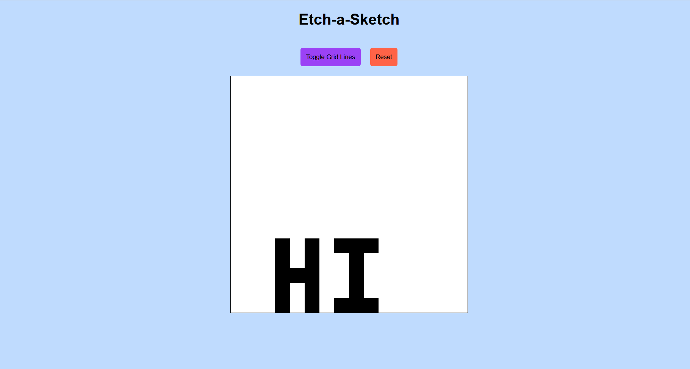

# Etch-a-Sketch - The Odin Project
My solution for the [Etch-a-Sketch](https://www.theodinproject.com/paths/foundations/courses/foundations/lessons/etch-a-sketch-project) project found in The Odin Project. The goal of this project was to create a webpage that displayed an initial 16x16 grid and change the color of the grid tile to black whenever the mouse hovers over the tile. The size of the grid can be changed by clicking the "Reset" button and entering a new size between 1-100. The grid lines can also be toggled by clicking the "Toggle Grid Lines" button. 

## Screenshots

